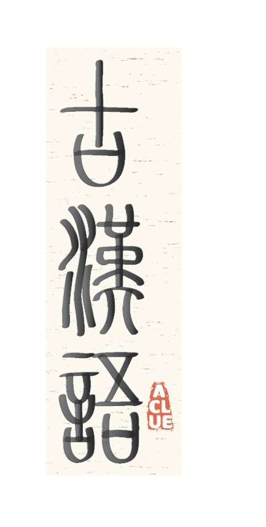

# ACLUE - Ancient Chinese Language Understanding Evaluation Benchmark

<h4 align="left">
    <p>
        <a href="README.md">简体中文</a> |
        <b>English</b> 
    <p>
</h4>

<p align="left" style="display: flex; flex-direction: row; justify-content: center; align-items: center">
📄 <a href="https://arxiv.org/abs/2310.09550" target="_blank" style="margin-right: 15px; margin-left: 10px">Paper</a> • 
🏆 <a href="#Leaderboard" target="_blank"  style="margin-left: 10px">Leaderboard</a> •
🤗 <a href="https://huggingface.co/datasets/tyouisen/aclue" target="_blank" style="margin-left: 10px">Datasets</a> 
</p>

## Introduction

The Ancient Chinese Language Understanding Evaluation (**ACLUE**) is an evaluation benchmark focused on ancient Chinese language comprehension. It aims to assess the performance of large-scale language models on understanding ancient Chinese. The benchmark comprises 15 tasks spanning various domains, including lexical, syntactic, semantic, inference, and knowledge. We encourage researchers to use ACLUE to test and enhance their models' abilities in ancient Chinese language understanding.
ACLUE's tasks are derived from a combination of manually curated questions from publicly available resources, and automatically generated questions from classical Chinese language corpora. The range of questions span from the Xia dynasty (2070 BCE) to the Ming dynasty (1368 CE). ACLUE adopts a multiple-choice question format for all tasks.

## Leaderboard 🏆

The table below presents model performance in the zero-shot settings. If you wish to contribute your model results, please contact us or submit a pull request.

#### Zero-shot
| model     | Lexical | Syntactic | Semantic | Inference | Knowledge | Overall |
|-----------|---------|-----------|----------|-----------|-----------|---------|
| [ChatGLM2-6B](https://huggingface.co/tiiuae/falcon-40b)   |   34.00   |   38.00   |   39.90   |   36.53   | **38.85** | **37.34** |
| [ChatGPT](https://openai.com/chatgpt)                     | **34.53** | **43.00** |   36.40   | **41.23** |   33.61   |   36.82   |
| [BLOOMZ-7B](https://github.com/bigscience-workshop/xmtf)  |   34.40   |   32.20   | **43.70** |   30.19   |   37.31   |   35.34   |
| [ChatGLM-6B](https://github.com/THUDM/GLM-130B)           |   32.80   |   36.60   |   30.50   |   34.59   |   32.81   |   33.23   |
| [Falcon-40B](https://huggingface.co/tiiuae/falcon-40b)    |   30.13   |   32.60   |   34.30   |   33.65   |   30.78   |   32.00   |
| [Baichuan-7B](https://github.com/baichuan-inc/baichuan-7B)|   28.00   |   32.20   |   32.80   |   30.40   |   34.56   |   31.75   |
| [LLaMA-65B](https://github.com/facebookresearch/llama)    |   28.33   |   33.00   |   29.60   |   29.10   |   27.56   |   28.76   |
| [MOSS-SFT-16B](https://github.com/OpenLMLab/MOSS)         |   28.00   |   24.00   |   27.50   |   27.42   |   24.34   |   26.29   |
| Random                                                    |   25.00   |   25.00   |   25.00   |   25.00   |   25.00   |   25.00   | 

The tasks for each category are as follows:
Lexical (T1: polysemy resolution, T2: homographic character resolution, T3: named entity recognition), Syntactic (T4: sentence segmentation), Semantics (T5: couplet prediction, T6: poetry context prediction), Inference (T7: poetry quality assessment, T8: reading comprehension, T9: poetry appreciate, T10: poetry sentiment analysis), Knowledge (T11: basic ancient chinese, T12: ancient chinese culture, T13: ancient medical, T14: ancient literature, T15: ancient phonetics).

## Data Format
Each question in the dataset is a multiple-choice question with 4 options, where only one option is the correct answer. The data is available in comma-separated .csv files. The data can be found in the following locations [data](data).

Here is an example of the data format:
```
"会当凌绝顶，一览众山小"是杜甫的名句，诗人登上了哪座山发出了这样的感慨？（）,五台山,黄山,泰山,衡山,C
Translation: "'Meeting at the summit, a panoramic view of all mountains small.' This famous line was penned by Du Fu. On which mountain did the poet stand to express such sentiment? () Wutai Mountain, Huangshan, Mount Tai, Mount Hengshan, C"
```

## Data
We provide development and test datasets for each topic in the [data/dev](data/dev) and [data/test](data/test) directories.

## Prompt
We provide preprocessing code in the `src/utils` directory.

Here is an example of data with direct answer prompts added:
```
     以下是关于{古诗词曲鉴赏}的单项选择题，请直接给出正确答案的选项。
     (The following is a multiple-choice question about {Ancient Poetry and Song Appreciation}. Please directly give the correct option.)
     题目：《木兰诗--北朝民歌》唧唧复唧唧,木兰当户织。不闻机杼声,唯闻女叹息。问女何所思,问女何所忆。女亦无所思,女亦无所忆。昨夜见军帖,可汗大点兵,军书十二卷,卷卷有爷名。阿爷无大儿,木兰无长兄,愿为市鞍马,从此替爷征。东市买骏马,西市买鞍鞯,南市买辔头,北市买长鞭。旦辞爷娘去,暮宿黄河边,不闻爷娘唤女声,但闻黄河流水鸣溅溅。旦辞黄河去,暮至黑山头,不闻爷娘唤女声,但闻燕山胡骑鸣啾啾。万里赴戎机,关山度若飞。朔气传金柝,寒光照铁衣。将军百战死,壮士十年归。归来见天子,天子坐明堂。策勋十二转,赏赐百千强。可汗问所欲,木兰不用尚书郎,愿驰千里足,送儿还故乡。爷娘闻女来,出郭相扶将;阿姊闻妹来,当户理红妆;小弟闻姊来,磨刀霍霍向猪羊。开我东阁门,坐我西阁床。脱我战时袍,著我旧时裳。当窗理云鬓,对镜帖花黄。出门看火伴,火伴皆惊忙:同行十二年,不知木兰是女郎。雄兔脚扑朔,雌兔眼迷离;双兔傍地走,安能辨我是雄雌?下列对这首诗的理解和分析,不正确的一项是()
     (Question: "Ballad of Mulan--Northern Dynasty Folk Song" Creak creak, and again creak creak, Mulan weaves at the door. Not hearing the sound of the loom, only the sighs of the girl. Asking the girl what she's thinking, asking the girl what she's remembering. The girl has nothing to think, the girl has nothing to remember. Last night she saw the military notice, the Khan is calling a big draft, twelve volumes of battle books, each one with her father's name. There's no elder son for father, no elder brother for Mulan, willing to buy a saddle and horse, and take her father's place in the army. Buying a fine horse in the eastern market, buying saddle and stirrups in the western market, buying a bridle in the southern market, buying a long whip in the northern market. Saying goodbye to her parents in the morning, staying beside the Yellow River at dusk. Not hearing her parents calling her, but hearing the Yellow River's splashing waves. Saying goodbye to the Yellow River in the morning, reaching Black Mountain by dusk. Not hearing her parents calling her, but hearing the Yan Mountain's barbarian cavalry crying jiu jiu. Ten thousand miles to the war, crossing mountains and passes like flying. The cold wind blows the golden drum, the cold light reflects on the iron armor. The general dies in a hundred battles, the strong soldier returns in ten years. Coming home to see the Emperor, the Emperor sits in the Ming Hall. Winning honors twelve ranks, rewards of thousands and hundreds strong. The Khan asks what she desires, Mulan doesn't want to be a high-ranking official, willing to ride a thousand miles,)
     A.  《木兰诗》是南北朝时期的一首长篇叙事民歌,风格刚健质朴。全诗以“木兰是女郎”来构思木兰的传奇故事,富有浪漫色彩。
     (A. "Ballad of Mulan" is a long narrative folk song from the Northern and Southern Dynasties period, with a robust and simple style. The entire poem is constructed around the idea of "Mulan is a girl," portraying Mulan's legendary story with romantic color.)
     B.  “愿为市鞍马”的“市”是“市场”的意思,“万里赴戎机”的“戎机”是“战事”的意思。
     (B. "Willing to buy a saddle and horse in the market" - "market" means "marketplace"; "Ten thousand miles to the war" - "war" means "war.")
     C.  木兰“不用尚书郎”而愿“还故乡”固然有对家乡的眷恋,但也有自己女儿身秘密的因素。
     (C. Mulan "doesn't want to be a high-ranking official" but wishes to "return to her hometown" does have a longing for her hometown, but also her secret factor as a daughter.)
     D.  “朔气传金柝,寒光照铁衣”运用对偶手法,描写了木兰在边塞艰苦的军旅生活。
     (D. "The cold wind blows the golden drum, the cold light reflects on the iron armor" uses parallelism to describe Mulan's hard military life on the frontier.)
     答案是：B
     (The answer is: B)


     ... [其他例子]

     题目：《虞美人》李煜。春花秋月何时了？往事知多少。小楼昨夜又东风，故国不堪回首月明中。雕栏玉砌应犹在，只是朱颜改。问君能有几多愁？恰似一江春水向东流。对《虞美人》的赏析,不恰当的一项是（）
     (Question: "Yu Mei Ren" by Li Yu. When will spring flowers and autumn moon end? How much of the past is known? The small tower was again hit by the east wind last night; I can't bear to look back at my homeland under the bright moon. The carved railings and jade pavements should still be there, only the rosy faces have changed. How much sorrow can you bear? Just like a river of spring water flowing east. The inappropriate analysis of "Yu Mei Ren" is ())
     A. 词作从眼前景物入手,生发联想和想像,追怀昔日帝王生活,描摹了一幅幅鲜活的画面,隐晦地表达出叛逆之情,惹恼了宋太宗,铸成了词人悲惨结局。
     (A. The poem begins with the immediate scenery, giving rise to associations and imaginations, recalling the past life of emperors, and vividly portraying various images, subtly expressing feelings of rebellion, annoying Emperor Taizong of Song, leading to the poet's tragic end.)
     B. 词作以实虚相间的手法来绘景、抒情、达意,忽而写眼前,忽而写想像。
     (B. The poem uses a technique of mixing reality with imagination to describe the scenery, express emotions, and convey meaning, sometimes writing about the present, sometimes the imagined.)
     C. 《虞美人》乃李煜绝笔词。
     (C. "Yu Mei Ren" is Li Yu's last masterpiece.)
     D. 《虞美人》以其形式别致给人美感愉悦。
     (D. "Yu Mei Ren" provides aesthetic pleasure with its unique form.)
     答案是：
     (The answer is: )
 ```
## Evaluation
The code for evaluation of each model we used is in [src](src), and the code to run them is listed in [script](script) directory.

## Citation
```
Zhang, Yixuan, and Haonan Li. "Can Large Langauge Model Comprehend Ancient Chinese? A Preliminary Test on ACLUE." Proceedings of the Ancient Language Processing Workshop. 2023.
```
## License
[](https://lbesson.mit-license.org/)

This work is licensed under a [MIT License](https://lbesson.mit-license.org/).

[](http://creativecommons.org/licenses/by-nc-sa/4.0/)

The ACLUE dataset is licensed under a
[Creative Commons Attribution-NonCommercial-ShareAlike 4.0 International License](http://creativecommons.org/licenses/by-nc-sa/4.0/).
